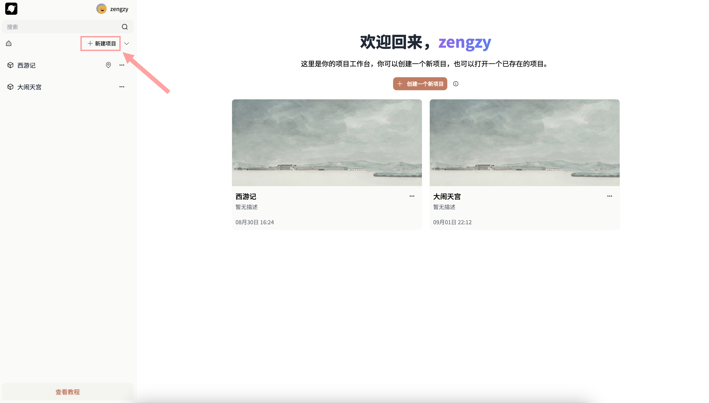
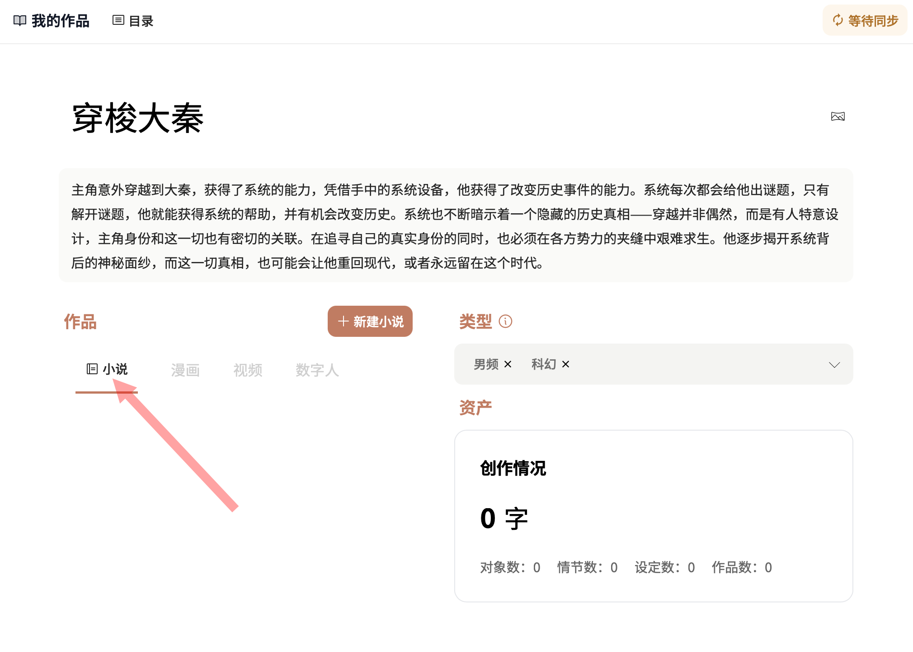
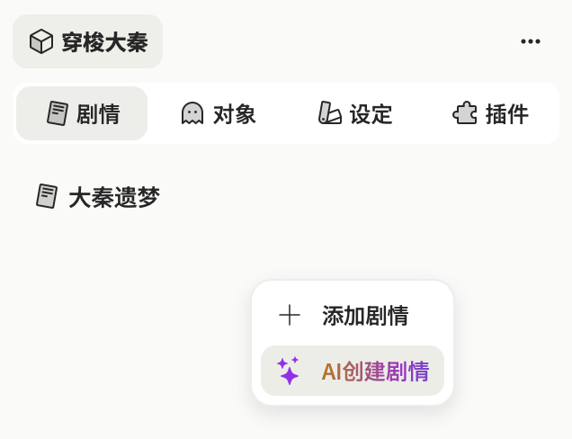
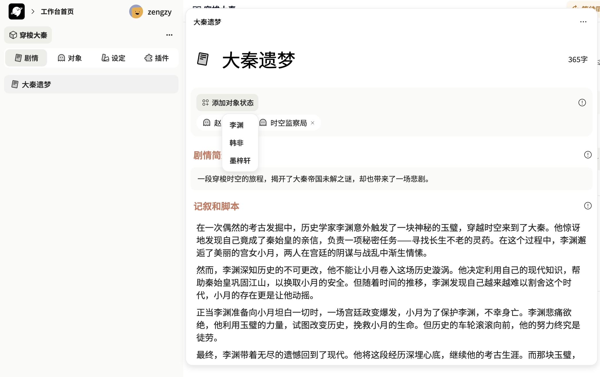

## 写作世界观的创建

### 创建项目

可选择直接[新建项目]创建一个新的世界

**选择作品类型**

- ·类型标签：选择作品的类型，包括男频/女频；仙侠、奇幻、爱情等等类型，类型标签会影响「剧情」生成的内容
- ·简介：作品的情节简介，简介中的内容会显著影响「剧情」及「对象」的生成内容

### 世界观设定

:::success 什么是「世界观」小说的创作之初，首先需要对作品「世界观」进行设定，包括作品的角色、剧情情节、一些特殊的设定、特殊的物品。介子中的「世界观」不仅仅是一个记录工具，还将直接影响AI生成的内容。介子的世界观中包含「对象」「情节」「设定」

:::

### 🎬 剧情

:::success 剧情
是你能想到的任何一个桥段，任意一个灵感，「剧情」可以用来直接转化成章节。一个剧情里的设定包括剧情的简介。

:::

1.AI添加剧情：除了手动添加剧情，如果你没有任何剧情的构思，在剧情面板右键点击「AI创建剧情」，AI会帮你自动生成剧情灵感。

创建剧情后，可以添加你在「对象」中所创建的任一「角色」、「物品」、「组织」等对象，「创意生成」时会将这些对象添加进剧情中。

2.AI创意生成：如果你已经有了一个大致的剧情构思，在剧情页面中的“记叙与脚本”栏中输入下划线“/”，点击「创意生成」，AI将为你继续生成剧情灵感，生成的内容会受到剧情中添加的对象影响

### 🎭 对象

:::success 对象的作用
是小说的世界观中最重要的部分，除了角色，还包括物品、组织和其他任何你能想到的内容，例如三体中的“水滴”，玄幻小说中的“异火”。对象对「创建剧情」、「创意生成」、
以及小说正文写作中的「内容续写」都将产生直接影响。
:::
1.AI添加对象：以“角色”「对象」为例，你可以手动添加角色，也可以通过右键通过AI直接创建角色。

2.对象标签：你可以任意添加新的标签，标签的内容决定了AI所创建的对象的类型，例如在「物品」标签下，AI将自动创建出物品类型的对象。

3.对象设置：在对象的设定中，可以任意添加对象的属性

4.更多玩法：从剧情中创建对象，在剧情中任意选择剧情所提及到的新角色、物品，可以选中——添加为对象

### 🏷️ 设定

1.设定2.设定的使用：

## 二、小说正文创作

### 新建小说

你可以在一个项目中创建多本小说，进入创建的小说后，就可以开始正文的写作了。

### AI章节生成

右键选择「章节化」或者拖动 「剧情组件」进入小说的目录，点击生成，可以根据你选择的剧情中的内容，以及该剧情中添加的「对象」生成任意数量的章节，以及章纲，确认后可将章节插入小说目录中。

### AI正文写作

AI续写：你可以直接一键写作，也可以继续续写，选中润色，扩写。
