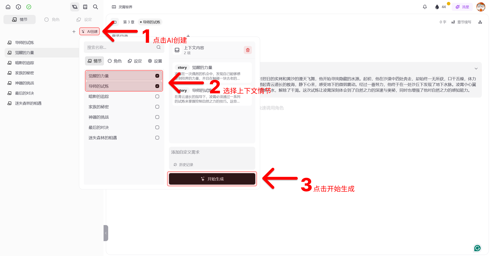

# 🪐世界观创作

## 创建世界观

### 新建一个世界观

- ·在首页输入你想创作的内容，点击`「⚙️」`设定好你创作内容的标签类型，或者是选择AI头脑风暴一键生成主题。
- ·也可选择直接「新建项目」创建一个新的世界

### 选择作品类型
- ·类型标签：选择作品的类型，包括男频/女频；仙侠、奇幻、爱情等等类型，类型标签会影响「剧情」生成的内容
- ·简介：作品的情节简介，简介中的内容会显著影响「情节」、「设定」及「对象」的生成内容

## 世界观设定、项目管理

:::success 什么是世界观？
小说的创作之初，首先需要对作品「世界观」进行设定，包括作品的角色、剧情情节、一些特殊的设定、特殊的物品。
介子中的「世界观」不仅仅是一个记录工具，还将直接影响AI生成的内容。介子的世界观中包含「情节」「角色」「设定」。

:::

### 世界观标签管理

在创作页面的左上角，点击`「 i 」`即可查看并修改主题的基本信息，这里有主题的编辑以及创作信息、世界观设定以及世界观标签等。
- ·世界观设定：主题的世界观设定，设定中的内容会显著影响「情节」、「设定」及「角色」的生成内容。这里也会包括一些你的整个世界的剧情梗概。
- ·性别：目前可以根据需要，选择男频、女频两类不同的创作文风类型标签。
- ·时代背景：根据你的时空设定需要，可以选择现代/古代或是未来等等不同的时空标签。
- ·类型标签：选择作品的类型，包括仙侠、奇幻、爱情等等类型，类型标签会影响「剧情」生成的内容。
- ·自定义标签：如果自己有新奇的想法，也可以自定义标签内容，AI会自动识别并以此为依据开始创作。

### 项目状态、保存、项目切换

- · 状态与保存：按Ctrl S即可保存项目以及小说，点击左上角的`「❕」`可以查看保存状态。黄色为未保存，绿色为已保存。
- · 项目切换：点击左上角的`「🪐」`，可以切换不同的世界观。点击左上角的`「📚」`，可以切换同一世界观下的不同小说。

## 🎬 情节

:::success 情节
情节是介子中最重要的概念之一，用来刻画整个故事发生的逻辑结构。是你能想到的任何一个桥段，任意一个灵感，「剧情」可以用来直接转化成章节。一个剧情里的设定包括剧情的简介。

:::

### 情节角色：
情节角色就是指你在此情节下出现的角色。点击「相关角色」在这里你可以添加已经设定好的角色。AI也会自动识别剧情中的角色。

### 情节结构（情节间的关系）：
在这里你可以交代剧情的梗概，故事骨干，即：开始的时间、地点、任务、剧情的起因经过以及结果，并将情节结构可视化在时间轴上，链接好下一个情节，做好情节的过渡。
情节的主要关系是上下文的关系。 通过剧情流的方式组织起来。
实际用于情节的单元发展以及 AI 生成的上下文参考。

### 情节的内容脚本：
完成对象添加以及情节结构创作后，你可以点击`「AI创建」`一键生成剧情脚本。
情节的脚本，是情节的详细描述，这种描述是对过程的详细描述。这种描述不涉及具体的表现形式， 比如对话、心理描写等。 只阐述情节的逻辑。在情节结构的基础上，在脚本中你可以查看到情节的详细内容，例如场景的气氛、现场的氛围等环境描写。

### 爆炸：

当你认为情节的脚本不够详细，不便于之后的章节化以及后续小说创作时，可以进行爆炸操作。
爆炸后会将当前的情节（脚本）分解为多个情节（脚本），并进一步细化。
点击右侧的`「···」`，你可以点击「爆炸」，将一个主要剧情拆解成几个子剧情，进行更细致的编写。你可以选择爆炸生成子剧情的数量以及输入爆炸要求来定制爆炸剧情的一些要求。

### 接续：

当你认为此情节的脚本已经足够详细，可以进行下一步情节的撰写，可以选择接续功能。
接续后会生成当前的情节（脚本）之后的新的情节脚本。你可以让AI根据当下的剧情创造出新的剧情，智能生成后续新的情节。你可以输入一些简单的定制指令，让章节续写更加的可控。

### 章节化：

当你认为情节的脚本已经足够详细，可以进行章节化操作。
章节化后会将当前的情节（脚本）分解为一个或多个章节的章纲，并进一步细化。
拖动左侧栏中已经写好的章节剧情到右侧创作栏中，AI会自动帮你扩写这一章节的章节原文，你也可以自己控制章节化的数量。

## 🎭 角色

:::success 角色
角色是小说的世界观中最重要的部分，不仅仅指人物角色。包括任何随时间有不同状态的组织、家族、势力、特殊的物品、建筑、场所等一切广义的你能想到的主体角色。例如三体中的“水滴”，玄幻小说中的“异火”。对象对「创建剧情」、「创意生成」、 以及小说正文写作中的「内容续写」都将产生直接影响。
:::

### 1. 创建角色：

1.AI 添加角色：以「角色」为例，你可以手动添加角色，也可以通过右键通过 AI 直接创建角色。

2.角色标签：你可以任意添加新的标签，标签的内容决定了 AI 所创建的角色的类型，例如在「物品」标签下，AI 将自动创建出物品类型的对象。

3.角色设置：在对象的设定中，可以任意添加角色的属性

4.更多玩法：从剧情中创建角色，在剧情中任意选择剧情所提及到的新角色、物品，可以选中——添加为角色。

### 2. 编辑角色：

- · 角色简介：填写简介，基本特征和形象。在此处你可以编辑角色的简介，也可以选择AI一键生成。

- · AI角色创建：你可以选定既有的情节，输入指定命令，比如：生成治愈系女法师，AI会根据选定的剧情自动生成新角色。

- · 角色类型：在此处你可以新建对象的类型比如：主要角色、次要角色，可以按照你的个人喜好、角色所属组织、或是角色个人属性进行分类，例如新建：荣国府、格兰芬多、结丹期。

- · 角色设定：在此处你可以添加事先已经写好的设定，注意，设定是不随时间因素而变化的，所以这将会是角色的固有属性。

- · 角色的状态：角色的状态和情节相关联。 角色在每一个情节中可能拥有不同的状态，用来标志其特征。

- · 角色关系网络：用来描述角色之间的关系。在此处你可以添加其他对象，并定义这两个对象之间的关系。

- · 角色动态和经历：用来描述在某个情节中的经历。点击角色的详情页，拖动顶部的时间可以查看该角色在不同时间线中出场的频次，在具体的某一场次中你可以细化角色在此情景下的一些细节描写。

## 🏷️ 设定
:::success 设定
设定是介子中核心概念之一，设定是世界观的基础。设定是随时间有不变的属性、概念等。你不仅可以用设定给这个世界增添规则，同时也可以利用设定给一些角色、物品等对象增添不随时间变化的固有属性。
:::

与情节、角色不同的是，设定是静态的，不会随着情节（时间）的发展而变化。例如：
- ·武侠、玄幻世界中的等级。
- ·古代世界中的官职等。
- ·MBTI 等性格测试。
- ·科幻小说中，物理学中的相关设定。
- ·等等。

### 设定的用途：
- ·用于角色状态属性中的选择。
- ·在生成情节、角色、以及小说写作过程中的上下文参考。

### 设定类型：
在这里你可以定义你的设定类型，比如修仙等级、灵根属性等等，通过对设定进行严谨细致的分类，可以进一步丰富、细化你的世界观。

### 子设定：
增添与此设定相关联的一些细节设定，例如灵根下属的木灵根、土灵根等等。

# 📚小说创作

## 创建并书写一部小说
:::success 小说
小说是你在该世界观下创作的具体作品正文，你可以用已有设定好的剧情、角色以及世界观的设定来书写完原文，你也可以让AI一键续写，按照你已经书写好的故事梗概来完成全部正文创作。
:::

进入创作页面后点击「创建小说」或是选择以往已经创建的小说，就可以开始小说的创作。

- · 章节目录：在这里你可以看到本小说各个章节标题以及其链接的情节名。

- · 章节大纲：是本章节中的故事梗概。

- · 小说描述：在这里你可以对你这一部小说作品的内容进行一个概括。

- · 章节续写：在这里你可以控制AI生成的字数等，AI可以按照你要求的字数进行续写，也可以直接要求AI按照你已经设定好的剧情直接完成本章。

- · 情节化：在小说章节正文书写的过程中，可能会出现新的未曾设定的情节，可以在快捷面板中选择“情节化”来讲小说的内容直接AI自动识别出新的情节归纳到情节一栏中。

- · 快捷键与快捷面板：#直接呼出快捷面板选用「章节续写」「对话输入」和「情节化」等快捷功能，@可以直接选择你创建的角色等对象。

## 小说内容编辑

### 章节情节化

在小说章节正文书写的过程中，可能会出现新的未曾设定的情节，可以在快捷面板中选择“情节化”来讲小说的内容直接AI自动识别出新的情节归纳到情节一栏中。

### 章节如何链接剧情？

在每章的左上角你可以自主链接已经书写好的剧情，来控制AI生成的走向。

### 创作中如何AI润色与AI扩写？

- · AI润色：你可以选择小说中的某段文字，按照你对文风的要求，AI会自动润色这段文字，润色后的文字会自动保存在生成库中。
- · AI扩写：你可以选择小说中的某段文字，要求AI自动扩写这段文字，扩写的文字会自动保存在生成库中。

### 什么是快捷面板？

键入#，呼出快捷面板。这里有一些写作中可以用到的小工具，例如行内对话调出AI来进行小段创作，跳转下一章，相似表达，AI词典等等。

- · 章节续写：在这里你可以控制AI生成的字数等，AI可以按照你要求的字数进行续写，也可以直接要求AI按照你已经设定好的剧情直接完成本章。

- · 对话输入：在此你可以调出AI对话，让AI按照你的文字指令生成小说正文，你可以直接将AI对话部分保留在小说章节的正文之中。

- · 情节化：在小说章节正文书写的过程中，可能会出现新的未曾设定的情节，可以在快捷面板中选择“情节化”来讲小说的内容直接AI自动识别出新的情节归纳到情节一栏中。

- · 下一章：直接跳转到下一章。